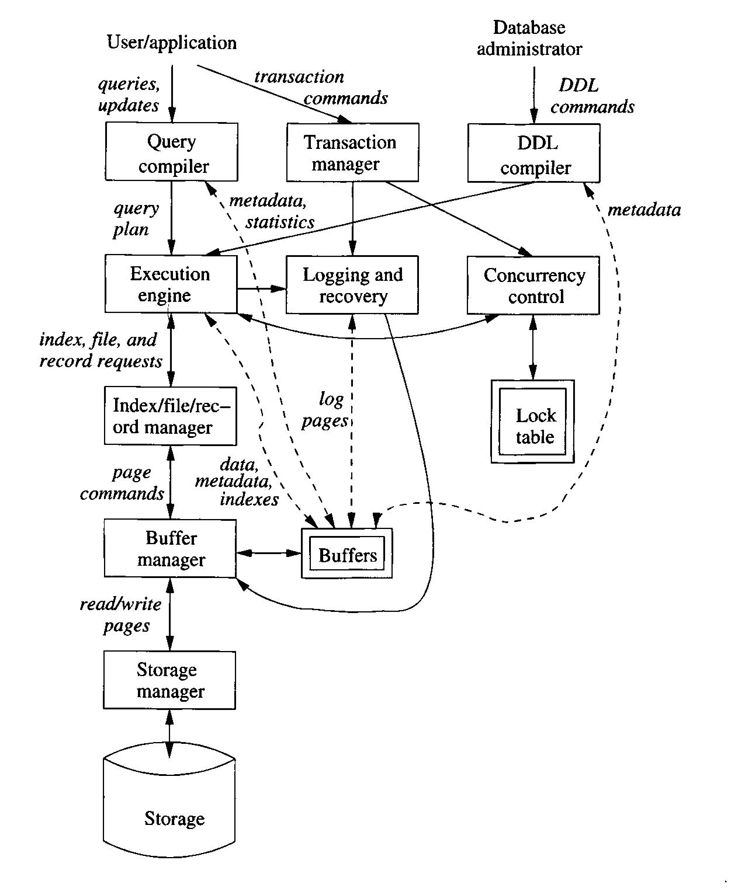

# Database Introduction/Overview

What is a database?

Class Answers
- A place where we store information
- Stores information in a way that it's accessible/available
    - Restrict access to the correct people
- Structures and organizes the data it contains
- 

A database is nothing more than a collection of information that exists over a long period of time. 

A database is a collection of information that's managed by a Database Management System

## DBMS Database Management System

What should a DBMS Do?

Class Answers
- Store information so that it's accessible
- Handle access by the right people
- Structures and organizes the data
- Manage backups/redundancy
- Allow us to perform operations on the data
- Distribute the data over multiple machines as necessary
- Make sure people can't read and write the same data at the same time
- Make sure the data is only modified when it should be


A DBMS Should:
1. Allow users to create new databases and specify their *schemas* (the logical structure of the data) using a specialized Data Definition Language
2. Give users the ability to query the data and modify the data using a *query language* or Data Manipulation Language
3. Support the storage of very large amounts of data over a long period of time, allowing for efficient access to the data for queries and database modification
4. Enable durability, the recovery of the database in the face of failures, errors of many kind, or intentional misuse
5. Control access to data from many users at once, without allowing unexpected interaction among users (isolation), and without actions being performed partially but not completely (atomicity)

## Brief History 

First commercial DBMS appeared in the late 1960's. They evolved from file systems. 

Drawbacks of Filesystems:
1. Supports (1) in a very limited way (structure of directories)
2. Limited way: search files
3. Does most of this (not good for efficient access/modification)
4. Not really (offsite-backups?)
5. Not really 

Early applications of DBMS were ones where data way composed of many small items that were frequently queried and modified: Airlines, Banks, Corporations (HR, payroll, inventory, sales, etc.)

Early DBMS required users to visualize the data more or less as it was stored. Several data models existed, but the common ones were:
- Hierarchical (tree structure)
- Graph-based (network structure)

They did not support higher-level query languages. Programs were complex to write, even for simple queries. 

### Relational Model

In 1970, EF Codd published a paper describing the Relational Data Model.

Presented the data to the programmer as a series of 2-dimensional tables, called Relations. 

Under the hood, the data could actually be stored in a much more complex data structure tha allowed for rapid responses to queries. But the database developer didn't need to be concerned with the underlying structure. Queries could be expressed in a higher-level language, meaning database programmers were much more efficient. 

By the 1980's, relational databases were the norm. Since then, we've seen a deviation in scale:
- Smaller systems: DBMS no longer requires a mainframe, the software runs on very small systems 
- Bigger data: amount of data stored in modern systems is huge (petabytes or exobytes)
    - Newer database techniques have been developed to handle queries on dataset on this scale
    
Today, the problem is often one of information integration. Data is often widely distributed across of number of separate databases and needs to be joined.

## Overview of a DBMS



# Data Models 

A data model is a notation for describing data of information

There are generally 3 parts to a data model:
1. The structure of the data.
    - Distinct from the data structures of other programming languages (structs, tree, etc.) (Physical data model)
    - We mean the "conceptual model" 
2. Operations on the data: queries or modifications
    - Limits on what can be done: good for efficiency
3. Constraints on the data

Important data models:
1. Relational Model, including object-oriented extension
2. Semi-structured Data Model 

A Good data model:
- Provides a simple, limited approach to structuring data, also is reasonably versatile, allowing anything to be modeled
- Provides a limited yet useful collection of operations on the data

These limitations become features. A simple data model is easy to understand and reason about. Allows for query languages that can express powerful queries simply, while still being optimized. 

## Relational Model

Provides a single way to represent data: a two-dimensional table called a *relation*.

The columns of a relation are called *attributes*. An attribute usually describes the meaning of the data in the column. 

The name of a relation and the set of attributes are called its *schema*. 

Attributes are a set, not a list. We usually define some standardized order. 

Denote a schema with `name(attribute, attribute, attribute, ...)`

Course relation:

`course(name, semester, location, time, capacity)`

In the relational model, a database consists of one or more relations. The set of schemas is called a *relational database schema* or *database schema*.

The rows of a relation are called *tuples*. A tuple has one *component* for each attribute of the relation

``` 
course(name, semester, location, time, capacity)
(Database Systems, S20, DCC 318, MR 4-6, 180)
(Operating Systems, S20, DCC 308, TF 10-12, 300)


```

The relational model requires that each component of a tuple be atomic

Each attribute has an associated domain

`course(name:string, semester:string, location:string, time:string, capacity:integer)`

Relations are sets of tuples, not lists. 

Relations are not static: they change over time.

The set of tuples for a given relation at a given time is called a *relation instance*.

Usually we keep only one relation instance: the *current instance*

Schemas may also change. In practice, that's very expensive. 