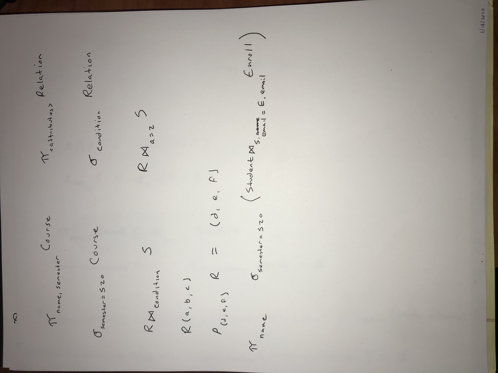

# Keys in the Relational Model

Many types of constraints that may be placed on the data in relations. 

Key constraints are fundamental

A set of attributes forms a *key* for a relation if we do not allow two tuples to have the same values for all attributes in the key.

Example:

`course(name, semester, time, location, capacity, professor, department, textbook)`

Possible keys:
- Time, Location, semester
- Professor, time, semester
- name, semester
- name, semester, time, location, capacity, professor, department, textbook
- 

We indicate the key by underlining the attributes of the key:

`course(_name_, _semester_, time, location, capacity, professor, department, textbook)`

We can specify a *primary key* for a relation, but it only matters for implementations of the model; it has no meaning in the relational model itself. 

Remember that a key is a statement about all possible instances of the relation, not just descriptive of the current instance. 

Artificial keys are commonly used (CRN, student id)

# SQL DDL

SQL: Structured Query Language

It's the main language used to define and manipulate relational databases

Two main aspects:
- Data-definition: for schemas
- Data-manipulation: for querying and modifying data

Latest SQL version is SQL 2016; textbook uses SQL 1999

Most commercial DBMS vendors implement something similar to, but not exactly the same as, the SQL standard

We'll use Postgres (mostly) for this class

Many others: MySQL (or MariaDB), Oracle, SQL Server, DB2, SQLite

## Relations in SQL

3 types:
- Stored Relations
    - called tables
    - exist in the database
    - have tuples
    - can be queried or modified
- Views: relations defined by computation
    - not stored
- Temporary tables: constructed by the SQL language processor when executing queries
    - discarded when done

We'll start with the DDL portion of SQL, specifically how to create a stored relation (or table)

`CREATE TABLE` is the basic command to create a stored relation

It defines the attributes and their types

Can also define constraints, indexes, etc. 

## SQL Data types

- Character Strings, of fixed or varying length
    - CHAR(n) (padded with blanks): `'text'` (single quotes, rather than double quotes)
    - VARCHAR(n) variable length character string
    - Postgres also provides a `TEXT` type
- Bit Strings, of fixed or varying length
    - BIT(n)
    - BIT VARYING(n)
- BOOLEAN
    - Possible values TRUE, FALSE, UNKNOWN
- Integer values
    - INT, INTEGER, LONG INT/BIG INT, SHORT INT
- Float/real values
    - FLOAT
    - REAL
    - DOUBLE PRECISION 
- Decimal values
    - DECIMAL(n, m) (decimal value with n places, m of which are after the decimal point)
    - NUMERIC(n, m) (same thing)
- Dates and Times
    - DATE: `DATE'YYYY-MM-DD'`
    - TIME: `TIME'HH:MM:SS.sss'`
    - DATETIME (TIMESTAMP in Postgres)
    - Postgres also provides INTERVAL

Notes on dates and times:

Dates and times may be case to strings 

Strings, if properly formatted, may be coerced into dates or times

Dates and times are incredibly complex. Refer to implementation-specific documentation 

Lots of other types: BLOB, XML, implementation-specific stuff

## Creating Tables

Simplest form `CREATE TABLE name(attributes)`

```postgresql
CREATE TABLE course(
    name VARCHAR(255),
    semester CHAR(3),
    time VARCHAR(127),
    location VARCHAR(127),
    capacity INT DEFAULT 100
);
```

### Modifying relations

`DROP TABLE tableName`

`ALTER TABLE tableName ADD attribute type`

```postgresql
ALTER TABLE course ADD textbook VARCHAR(127);
```

`ALTER TABLE name DROP attribute`

### Default Values

When we create tuples or modify them, we might not have values for all the attributes. If we don't specify a value, SQL will fill in `NULL`. We might not want that, so can specify a default value to use instead.

```postgresql
ALTER TABLE course DROP textbook;

ALTER TABLE course ADD textbook VARCHAR(127) DEFAULT 'none';

```

### Declaring Keys

2 places we can declare a key:
- Declare one attribute to be the key when we define it
- Add to the list of items defined in the schema a declaration with a specific set of attributes

```postgresql
CREATE TABLE student(
    name VARCHAR(255),
    email VARCHAR(255) PRIMARY KEY
);

CREATE TABLE course(
    name VARCHAR(255),
    semester CHAR(3),
    time VARCHAR(127),
    location VARCHAR(127),
    capacity INT DEFAULT 100,
    PRIMARY KEY(name, semester)
);

```

If a key has more than attribute, you have to use the second approach

There are two declarations we can use:
- `PRIMARY KEY(attributes)`
- `UNIQUE(attributes)`

If we use PRIMARY KEY, the DBMS won't allow NULL values to be in any of the attributes of the key

Note that Postgres doesn't consider two NULL values to be equal for the purposes of the constraint

```
CREATE TABLE r(
    a CHAR,
    b CHAR UNIQUE
);

(1, NULL)
(2, NULL) (doesn't violate the constraint)
(1, NULL) (still doesn't violate the constraint)
```


# Relational Algebra

Relational Algebra is a special algebra that defines operators that construct new relations from existing relations

Not used directly by commercial DBMS (SQL is used instead)

SQL is built around relational algebra and provides some "syntactic sugar" on top of it. 

Why relational algebra? It's useful because it's less powerful than C or Java. The limits allow for ease of use and better optimization.

## What is an Algebra?

An algebra in general, consists of operators and atomic operands (generally use parentheses for grouping)

Relational Algebra's atomic operands are:
- Variables that stand for relations (like R and S)
- Constants that are finite relations 

Operators fall into 4 broad categories:
- Set Operations (Union, Intersection, and Difference), applied to relations
- Operators that remove part of a relation
    - Selection removes some tuples
    - Projection removes some columns
- Operators that combine tuples of two relations
    - Cartesian Product (all possible pairs)
    - Various Joins (selectively pair tuples)
- Renaming

We'll refer to expressions of relational algebra as *queries*.

## Set Operations:

Union, Intersection, Difference

R ∪ S

Some restrictions that apply when applied to relations:
- R and S must have identical schemas: both names and types of all attributes must match
- Before we do the computation, we re-order the columns so that the attributes are in the same order

``` 
R(a, b)
(1, 2)
(2, 2)
(2, 3)

S(a, b)
(1, 2)
(3, 3)
(2, 3)

R ∪ S
(1, 2)
(2, 2)
(2, 3)
(3, 3)

R ∩ S
(1, 2)
(2, 3)

R − S
(2, 2)

```

## Removal Operators

*Projection* produces from R a new relation that has only some of the columns of R



*Selection* produces from R a new relation that has only some of the tuples of R


## Combinations:

*Cartesian Product* (Cross-Product or just Product)

R ⨯ S is the set of pairs rs that can be formed by choosing r to be any element of R and s to be any element of S

When applied to relations, we end up with a set of longer tuples whose schema is the schema for R plus the schema for S

By convention, the first relation's attributes are first.

If there are duplicate names, we disambiguate by pre-pending the relation name: R.a

```
R(a, b)
(1, 2)
(2, 2)

S(b, d)
(1, 2)
(3, 3)
(2, 3)

R ⨯ S
(a, R.b, S.b, d)
(1, 2, 1, 2)
(1, 2, 3, 3)
(1, 2, 2, 3)
(2, 2, 1, 2)
(2, 2, 3, 3)
(2, 2, 2, 3)
```

*Joins* allow us to pair only those tuples that match in some way

*Natural Join* is the simplest.

R ⨝ S

We pair only those tuples that agree on all values of whatever attributes R and S have in common

We end up with a relation whose schema is the union of the schemas of R and S

It's possible for any given tuple to pair with more than one tuple of the other relation

A tuple that pairs is called a *joined* tuple

A tuple that does not pair is called a *dangling* tuple

``` 
R(a, b)
(1, 2)
(2, 3)

S(b, d)
(1, 2)
(3, 3)
(2, 3)

R ⨝ S
(a, b, d)
(1, 2, 3)
(2, 3, 3)

```

*Theta Joins* pair tuples using a specific join condition

Theta join produces a schema like that produced by the Cartesian product: the overlapping attributes are disambiguated, not merged

``` 
R(a, b)
(1, 2)
(2, 3)

S(b, d)
(1, 2)
(3, 3)
(2, 3)

R ⨝ (d=3) S
(a, R.b, S.b, d)
(1, 2, 3, 3)
(1, 2, 2, 3)
(2, 3, 3, 3)
(2, 3, 2, 3)
```

## Renaming

Specifies a new schema for R

## Combining Operations to form Queries

Like other algebras, we can form expressions of arbitrary complexity by applying additional operators to the results of previous operations. 

``` 
Course(name, semester, time, location, capacity)
Student(name, email, major)
Enroll(student_email, course_name, semester)

```


⊆ 2286
∅ 2205
− 2212
∩ 2229
∪ 222A

𝜎 1d70e
𝜋 1d70b
𝜃 1d703
𝜌 1d70c
⨝ 2a1d
⨯ 2a2f
−
∪
∩
σ
π
×
⨝
θ
ρ
⊆
∅
