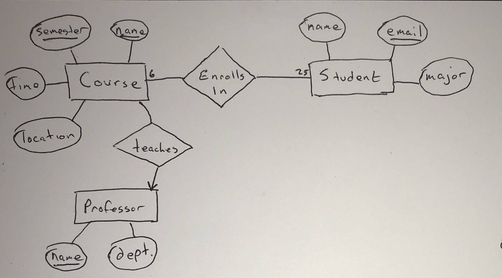
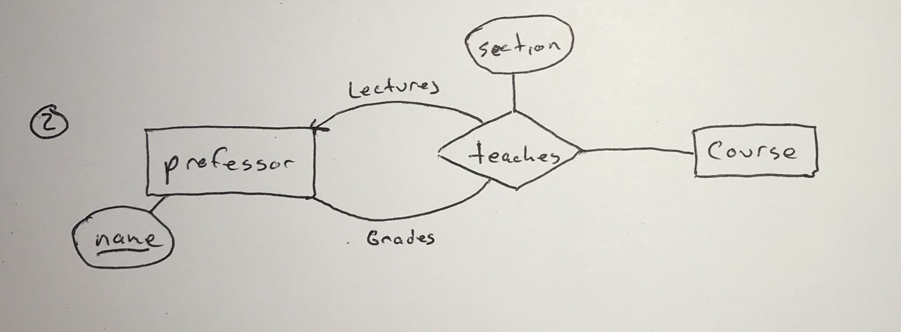
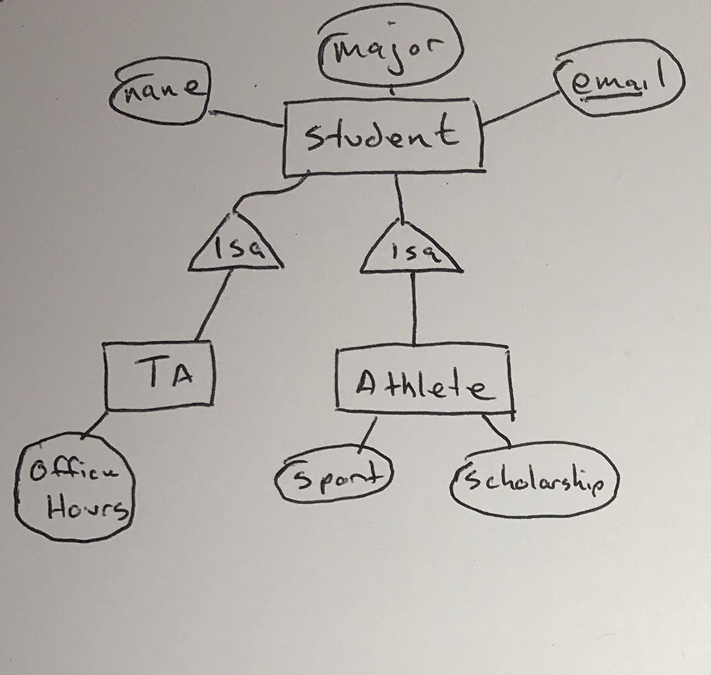
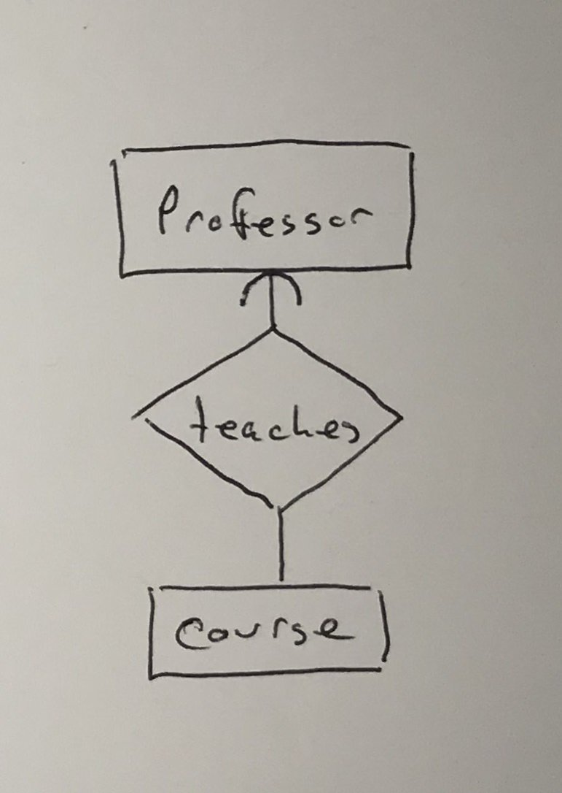
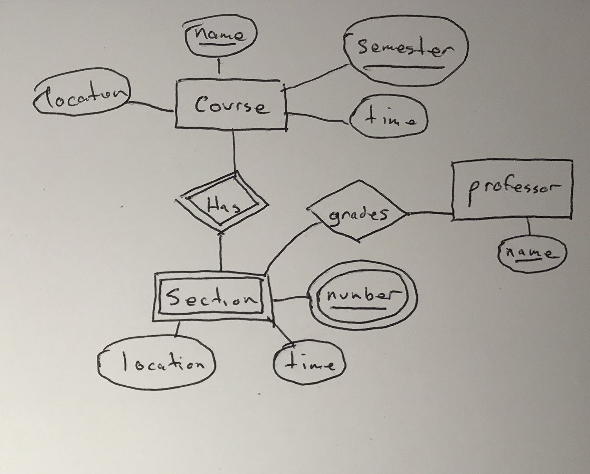

# Entity-Relationship Model

Consider the process used to design a database for an application

Begin with a design phase: answer questions related
- What information will be stored
- How information elements will be related to each other
- What constraints apply or will be assumed
- etc...

A large majority of commercial database systems use the relational model

Should the design phase use this model as well?

In practice, it's easier to start with a higher level model and convert to a relational model later

Main reason: the relational model only captures one concept: the relation. It's not always close to real-world scenarios

Several alternatives that are commonly used:
- Entity-relationship diagram
- Unified Modeling Language
- Object description Language

Whatever approach is used, there are procedures for converting the higher-level design into a relational model, which can be run on a database. 

## Entity/Relationship Model

A data model in which the structure of data is represented graphically, in an "entity-relation diagram."

3 principle element types:
- Entity sets
- Attributes
- Relationships

**Entity Sets**:

An *entity* is an abstract object of some sort.

A collection of similar entities forms an *entity set*.

An entity set is similar to the idea of a class or type in an OO lanuage. However, the E/R model is static: it deals only with the structure of the data, not operations on it. 

**Attributes**:

Entity sets have associated *attributes* which are properties of the entities of that set.

Different versions of the E/R model have different rules for the type of an attributes

We'll assume they are primitives (int, string, booleans)

Others might assume a struct-like structure

Or a set of values of some type, either primitive or struct

**Relationships** are connections between two or more entity sets

Binary relationships are the most common. However, E/R diagrams allow for multiway relationships

## Entity/Relationship Diagrams

An E/R diagram is a graph representing entity sets, relationships, and attributes. 

Different shapes are used to represent each types:
- Entity sets are rectangles
- Attributes are ovals
- Relationships are diamonds

### Instances of an E/R Diagram

E/R diagrams are a notation for describing schemas of a database. We may imagine it containing an instance of the data, but that's just an abstraction. It's useful to imagine the database as if it existed.

For each entity set, the database will have a finite set of entities. Each entity has values for each of the attributes. 

A relationship R that connects entity sets E1, E2, ..., En may be thought of as a set of tuples (e1, e2, ..., en) with values chosen from the entities in ei. These entities (tuples) may be thought of as connected by the relationship R.

This set of tuples is called a *relationship set*.

It can be helpful to visualize it as a table or relation, but the values of the tuples are other tuples, not atomic values. 

### Multiplicity of Binary E/R relationships

In general, a relationship can connect any number of entities from one member set to any number of entities in another. 

In practice, it's common for there to be a restriction on the "multiplicity" of the relationship.

Suppose R is a relationship connecting entity sets E and F.
- If each entity in E can be connected to at most one entity of F, we say R is *many-to-one* from E to F.
- If R is many-to-one from E to F, and many-to-one from F to E, we say R is *one-to-one*.
- If R is neither many-to-one from E to F, nor from F to E, we say R is *many-to-many*.

We use arrows to denote the multiplicity of relationships. If a relationship is many-to-one from E to F, we show an arrow entering F.

Remember that an arrow means "at most one." It doesn't guarantee the presence of entity in F (not a referential integrity constraint).

It's worth noting that a many-to-one relationship is special case of many-to-many relationship. Anything that applies to many-to-many relationships will also hold for many-to-one.

Similarly a one-to-one relationship is a special case of many-to-one. 

### Roles in Relationships 

It's possible for entity set to appear multiple times in a given relationship

We denote this by drawing multiple lines. Each line to the entity set represents a different *role* the entity set plays in the relationship. We label each role.

### Attributes on Relationships

We can associate attributes with relationships, not just entity sets

### Subclasses in the E/R Model

Often, entities may contain certain properties not associated with all the entities in the entity set.

We can form special case entity sets or *subclasses*, each with their own attributes and relationships.

We connect a subclass to its parent using a special relationships: "isa"

Because it's a special type of relationship, we denote it with a triangle instead of a diamond.

Every "isa" relationship is one-to-one

A collection of "isa" relationships could have any structure. For this class, we'll limit ourselves to tree structures (no multiple inheritance)

Given a tree structure, any given entity is made up of *components* from the entity sets in the subtree, including the root. 

## Design Principles

Some principles of good data model design:

**Faithfulness**: the design needs to be faithful to the specifications of the application. Entity sets and their attributes should reflect reality. Whatever relationships we assert should reflect what we know about reality. 

**Avoid Redundancy**: we should be careful to say everything only once
    - We discussed problems raised by anomalies
    - E/R model gives us new ways to introduce redundancy: for example, attributes may exist on more than one entity set

**Simplicity Counts**: avoid introducing more elements into your design than is absolutely necessary

**Choose the right relationships**: we have a number of ways to connect entity sets. Adding every possible relationship generally doesn't help.
    - Several relationships might reflect the same information 
    - One relationship might be derived from the others

**Pick the right kind of element**: often we have a choice between attributes and entity set-relationships to model a concept. Attributes are usually simpler. Making everything an attribute will often lead to problems. 

When can we replace entity set E with attributes of other entity sets? 

If E follows several conditions, it can be replaced
- All the relationships involving E have arrows entering E (E is the "one" in many-to-one relationships)
- If E has more than attribute, then no one attribute depends on the others. The only key for E is all of its attributes
- No relationship involves E more than once.

If the conditions are met, we replace E as follows:
- If there is a many-to-one relationship R from F to E, remove R, make attributes of E (and R) into attributes of, renaming as needed. 
- If there's a multiway relationship R with an arrow to E, delete the arc from R to E and move the attributes of E to R.

## Constraints in the E/R Model

There are several ways to express the concept of a constraint in the E/R model:
- There's way to express the idea of a key
- Referential integrity constraints
- Others

### Keys

A key for an entity set E is a set of one or more attributes K, such that no two distinct entities can have the same values for all attributes of the key. 

Things to remember:
- Every entity set must have a key. In some cases ("isa" hierarchies and weak entity-sets), the key or parts of it, may reside elsewhere.
- There can be more than one possible key. It's customary to pick one and act as if it were the only key.
- When an entity set is involved in an "isa" hierarchy, we require that the root entity set have all attributes for the key.

Just like the relational model, we denote an attribute's presence in the key by underlining it. 

### Referential Integrity Constraints

Referential integrity constraints state that a value appearing in one context must also appear in another related context.

We use a rounded arrow to denote that a relationship is not only many-to-one, but that a value is required to exist.

### Degree Constraint

We can attach a bounding number to the edges that connect a relationship and an entity set

### Weak Entity Sets

It's possible for an entity set to be composed of attributes, some or all of which belong to another entity set. This is called a *weak entity set*.

Two main causes of weak entity sets:
- Sometimes things fall into hierachies unrelated to "isa"
- The connecting entity sets from eliminating a multiway relationship.

Requirements for Weak Entity Sets:

The key for weak entity set W consists of:
- Zero or more attribute of its own, and
- Key attributes from entity sets that are connected by certain types of many-to-one relationships called *supporting relationships*

In order for many-to-one R from E to F to be a supporting relationship for E, the following conditions hold:
- R must be a binary, many-to-one relationship from E to F
- R must have referential integrity from E to F (rounded arrow)
- The attributes that F supplies to E must be key attributes of F
- If F is weak, the attributes supplied will be key attributes another entity set G, which is a supporting entity set for F, and so on. 

If an entity set is weak: 
- its border will be doubled
- its supporting relationships are shown with double borders
- If it supplies any attributes for its own key, then those attributes will be doubled

Note that the double-border diamond is only used for supporting relationships. A weak entity set may participate in other relationships that aren't supporting.

## Converting from E/R Diagrams to Relational Models

Basics are straight forward:
- Turn each entity set into a relation with the same set of attributes
- Replace a relationship by a relation whose attributes are the keys for the connecting entity sets

Special cases to deal with:
- Weak entity sets
- Isa relationships/hierarchies
- Sometimes, we may want to combine two create relations, particularly the relations created from a relationship and a connected entity set

**Non-Weak-Entity Sets**: create a relation with the same and set of attributes

**Relationships**: the relation created will have the following attributes:
- The attributes of the relationship
- The key attributes of any connected entity sets

If an entity set appears multiple times in different roles, then its key attributes must appear once for each role. They must be renamed to avoid ambiguitiy

### Combining Relations

Sometimes, the relations we get by converting entity sets and relations may not be the best possible relations for the given data.

A common example occurs when there is an entity set E with a many-to-one relationship R to another entity set F.

The relations E and R will both contain the key for E in their schema. E will also have other attributes. R will have its own attributes, plus the key for F.

Because R is many-to-one, all the attributes are functionally determined by the key of E.

We combine E and R into one relation containing:
- All the attributes of E
- The key attributes of F
- Any attributes of R

Whether to combine or not is a matter of judgment. It can be more efficient. Can also lead to redundancy.

### Handling Weak Entity Sets

We do three things differently:
- The relation weak entity set W must include not only the attributes of W, but the key attributes of supporting entity sets
- The relation for for any relationship involving w must use all the key attributes for w, not just those appearing in w itself
- A supporting relationship for w doesn't need to be converted. Its attributes can be added to the relation for w

### Converting subclass structures to relations

There are three approaches for converting "isa" relationships/hierarchies
- Follow the E/R viewpoint:
    - create relations for every entity set in the hierarchy, using key attributes from the root as necessary.
- Treat entities as objects belonging to a single class
    - For each possible subtree that includes the root, create a relation whose schema includes all the attributes of the subtree
- Use NULL values
    - create one relation containing all the attributes of all the entity sets in the hierarchy. 
    - Each tuple will have null values for attributes that do not apply